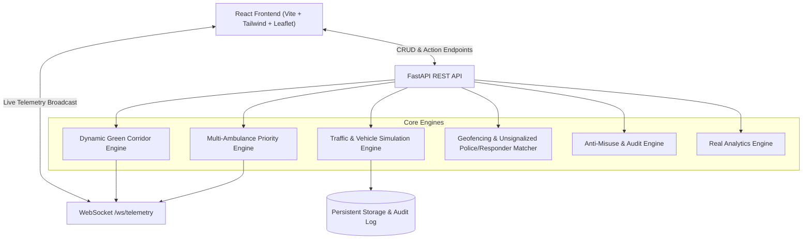

# 🚑 Emergency Mobility Corridor
> **"From Patient to Hospital — A Smarter Emergency Route"**

[](https://fastapi.tiangolo.com)
[](https://react.dev)
[](https://leafletjs.com)
[]()

**Emergency Mobility Corridor** is an intelligent, multi-agency transit coordination platform designed for Indian urban topologies (modelled on the AIIMS / Ring Road corridor in New Delhi). It dynamically pre-empts traffic signals, alerts traffic police at unsignalized bottlenecks, mobilizes opt-in citizen first responders, coordinates trauma bays, and regulates verified private patient vehicles.

---

## 🌟 Key Features & Operator Dashboards

- 🚑 **Ambulance Driver Mobile App**: Two-Phase Mission Lifecycle (`Phase 1: AMBULANCE → PATIENT` $\rightarrow$ `[ PATIENT ONBOARD ]` $\rightarrow$ `Phase 2: PATIENT ONBOARD → HOSPITAL`), live signal countdown HUD, and vertical obstacle radar.
- 👮 **Traffic Police Tactical App**: Real-time intercept alerts for heavy unsignalized intersections (e.g. Defence Colony Market Bottleneck) with *zero patient medical data leakage*.
- 📱 **Opt-in First Responder Network**: 3-tier responder network (*Community Volunteer*, *Trained First Responder*, *Verified Medical Professional*) with geofenced temporary assistance alerts under the **"Notify, Don't Track"** privacy protocol.
- 🚗 **Private Vehicle Emergency Mode**: Emergency transport portal enforcing a strict 4-tier hierarchy (*Ambulance > Verified Private > Unverified Private > Normal*) with token validation (`ER-7F29A`) and legal anti-misuse disclaimers.
- 🏥 **Hospital Trauma Bay Console**: Live incoming ambulance feed, trauma bay readiness allocation, and dispatch token generation.
- 🚦 **Traffic Control Center Admin**: Interactive metropolitan map, dynamic signal controllers (S101–S106), multi-ambulance conflict manager, and audited manual overrides.
- 📊 **Governance, Anti-Misuse & Analytics**: Journey anomaly detection audit table, rate-limiting, and charts (*65.9% travel time reduction*, *87.2% signal delay reduction*).
- 🏆 **20-Step Guided Hackathon Demo Runner**: Built-in interactive presentation wizard walking judges through the complete emergency workflow.

---

## 🏗️ Architecture



---

## 🚦 Safe Signal Transition State Machine

Signals never transition directly to Green. They adhere to the following sequence:

$$\text{Normal Phase} \longrightarrow \text{Warning / Yellow (4s)} \longrightarrow \text{All-Red Clearance Gap (3s)} \longrightarrow \text{Emergency Green} \longrightarrow \text{Post-Pass Gap} \longrightarrow \text{Normal Cycle}$$

---

## 🚀 Getting Started

### Prerequisites
- Python 3.10+
- Node.js 18+ & npm

### 1. Clone Repository
```bash
git clone https://github.com/desaipurv/Emergency-corrider.git
cd Emergency-corrider
```

### 2. Backend Setup
```bash
cd backend
python -m pip install -r requirements.txt
python -m uvicorn app.main:app --host 127.0.0.1 --port 8000
```

### 3. Frontend Setup
```bash
cd frontend
npm install
npm run dev
```

Open your browser at **`http://localhost:5173`**.

---

## 🧪 Running Automated Tests

```bash
cd backend
python -m pytest tests
```

---

## 📜 Governance & Privacy Principle

> **"Notify, Don't Track."**  
> Random citizens are never tracked. Responders participate strictly on an opt-in basis. Sensitive patient medical diagnosis data is never broadcast to traffic or police feeds.

---

## 👨‍💻 Developed by
**Purv Desai** — *Emergency Mobility Corridor Initiative*